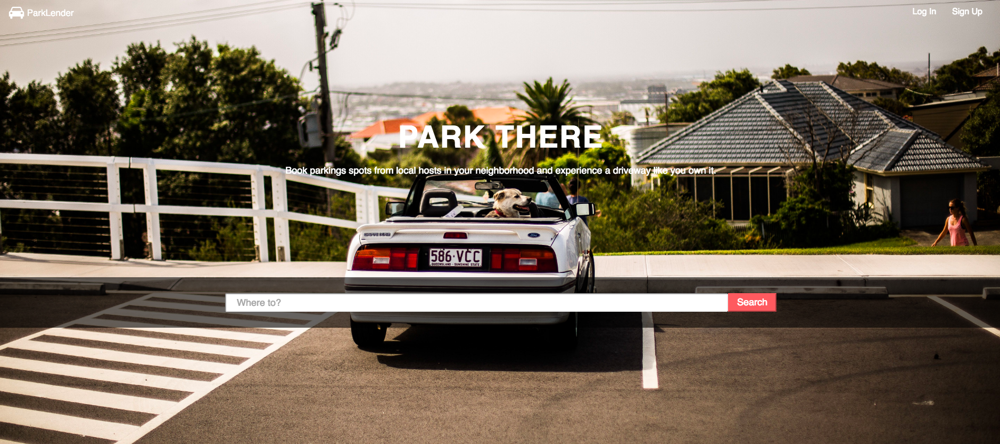
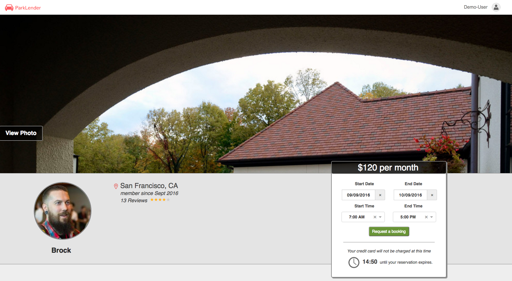
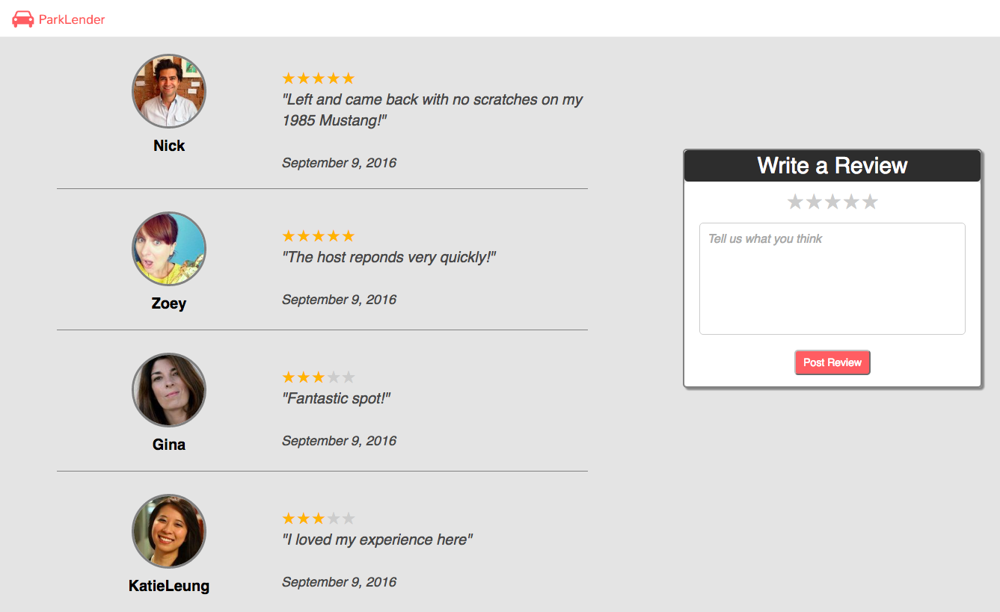

# ParkLender

ParkLender is a parking space sharing app inspired by AirBnB.

Check it out live at: [https://parklender.herokuapp.com/](https://parklender.herokuapp.com/)

**Key Feature Set:**
- Users can search for parking spots.
- Users can request to book a parking spot.
- Parking spot searches can be filtered by price type rates.
- Users can post reviews on each parkings spot.

***Try out a demo account!***

***Check out parking spots***

***Filter by price types***

***Search by location***

***Send a booking request***

***Write a review***

